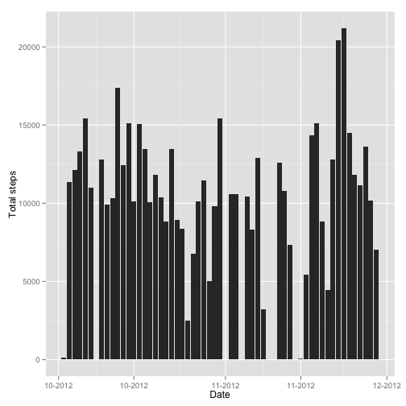

# Reproducible Research: Peer Assessment 1


## Loading and preprocessing the data

```r
library(scales)
library(ggplot2)
activity <- read.csv(unzip("activity.zip","activity.csv"),header = TRUE)
activity$date <- as.Date(activity$date)
```

## What is mean total number of steps taken per day?


```r
total_steps <- aggregate(list(steps=activity$steps),by=list(date=activity$date),FUN="sum")
ggplot(total_steps, aes(x=date, y=steps)) + geom_bar(stat="identity") + scale_x_date(labels = date_format("%m-%Y")) + xlab("Date") + ylab("Total steps")
```

 

The **Mean** is  10766.189 and the **Median** is 10765

## What is the average daily activity pattern?

```r
day_average <- aggregate(steps ~ interval, data=activity, mean, na.rm=TRUE, na.action=na.pass)
max_interval <- day_average[which.max(day_average$steps),c("interval")]
ggplot(day_average, aes(x=interval, y=steps)) + geom_line() + xlab("Interval") + ylab("Mean Steps") + geom_vline(xintercept=max_interval,colour="red")
```

 

The Interval with maximun activity is between **835:840**

## Imputing missing values
1. The total number of missing values in the dataset is **2304**
2. The strategy choosen to filling the missing values is use the mean for the corresponding 5 minute interval.


3. Create a new dataset that is equal to the original dataset but with missing data filled in.

```r
fixed_activity <- activity
for (i in 1:nrow(fixed_activity)){
    if (is.na(fixed_activity[i,c("steps")])){
        interval <- fixed_activity[i, c("interval")]
        fixed_activity[i,c("steps")] <- day_average[day_average$interval==interval,c("steps")]
    }
}
```
####Summary of the original data

```r
summary(activity)
```

```
##      steps            date               interval   
##  Min.   :  0.0   Min.   :2012-10-01   Min.   :   0  
##  1st Qu.:  0.0   1st Qu.:2012-10-16   1st Qu.: 589  
##  Median :  0.0   Median :2012-10-31   Median :1178  
##  Mean   : 37.4   Mean   :2012-10-31   Mean   :1178  
##  3rd Qu.: 12.0   3rd Qu.:2012-11-15   3rd Qu.:1766  
##  Max.   :806.0   Max.   :2012-11-30   Max.   :2355  
##  NA's   :2304
```
####Summary of the data without missing values

```r
summary(fixed_activity)
```

```
##      steps            date               interval   
##  Min.   :  0.0   Min.   :2012-10-01   Min.   :   0  
##  1st Qu.:  0.0   1st Qu.:2012-10-16   1st Qu.: 589  
##  Median :  0.0   Median :2012-10-31   Median :1178  
##  Mean   : 37.4   Mean   :2012-10-31   Mean   :1178  
##  3rd Qu.: 27.0   3rd Qu.:2012-11-15   3rd Qu.:1766  
##  Max.   :806.0   Max.   :2012-11-30   Max.   :2355
```

4.Make a histogram of the total number of steps taken each day and Calculate and report the mean and median total number of steps taken per day.

```r
total_steps_fixed <- aggregate(list(steps=fixed_activity$steps),by=list(date=fixed_activity$date),FUN="sum")
ggplot(total_steps_fixed, aes(x=date, y=steps)) + geom_bar(stat="identity") + scale_x_date(labels = date_format("%m-%Y")) + xlab("Date") + ylab("Total steps")
```

 

The **Mean** is  10766.189 and the **Median** is 10766.189

The are no big differences between the values, the mean remains equals and the median approximates more to mean.

## Are there differences in activity patterns between weekdays and weekends?
1. Create a new factor variable in the dataset with two levels **weekday** and **weekend** indicating whether a given date is a weekday or weekend day.

```r
weekday_vector <- weekdays(fixed_activity$date) %in% c("Monday", "Tuesday", "Wednesday", "Thursday", "Friday")
fixed_activity$day_type<-factor(weekday_vector, labels=c("weekend","weekday"))
str(fixed_activity)
```

```
## 'data.frame':	17568 obs. of  4 variables:
##  $ steps   : num  1.717 0.3396 0.1321 0.1509 0.0755 ...
##  $ date    : Date, format: "2012-10-01" "2012-10-01" ...
##  $ interval: int  0 5 10 15 20 25 30 35 40 45 ...
##  $ day_type: Factor w/ 2 levels "weekend","weekday": 2 2 2 2 2 2 2 2 2 2 ...
```

2. Make a panel plot containing a time series plot (i.e. type = "l") of the 5-minute interval (x-axis) and the average number of steps taken, averaged across all weekday days or weekend days (y-axis).


```r
mean_daytype_interval <- aggregate(list(steps=fixed_activity$steps),by=list(day_type=fixed_activity$day_type,interval=fixed_activity$interval),FUN="mean")
qplot(interval, steps, data=mean_daytype_interval, facets = day_type ~ . , geom = "line",ylab = "Steps Average")
```

 

The activity en weekdays starts early, with a peak around 8:35, after this hour the activity in weekend days is greater than in weekdays.
